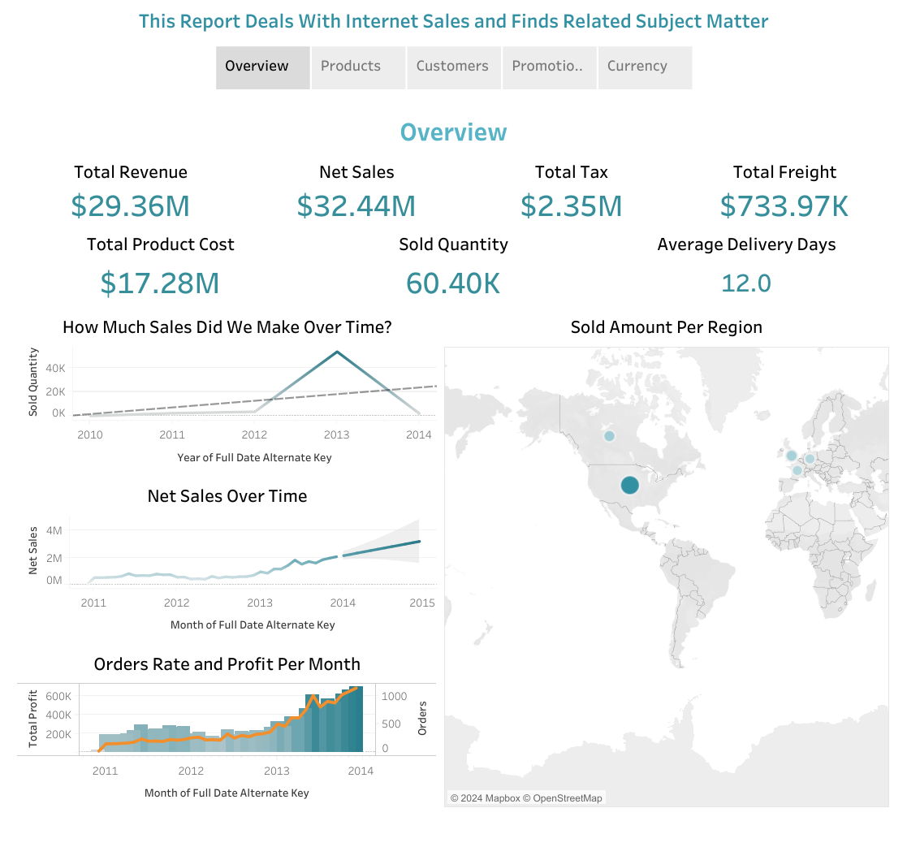
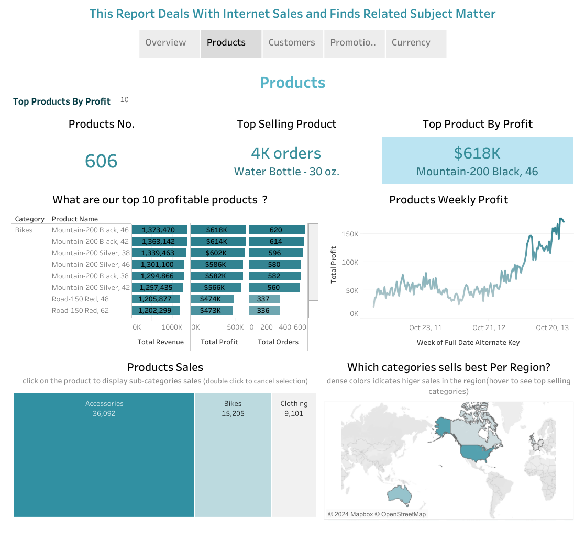
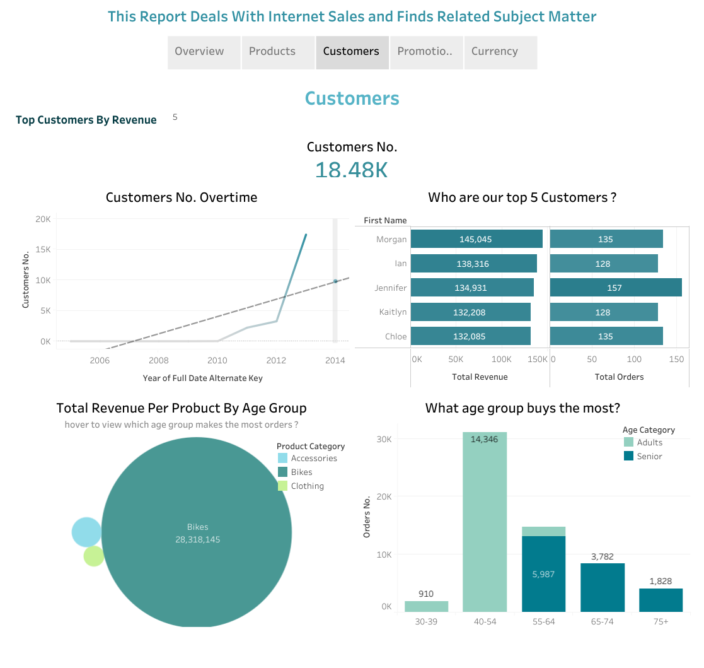
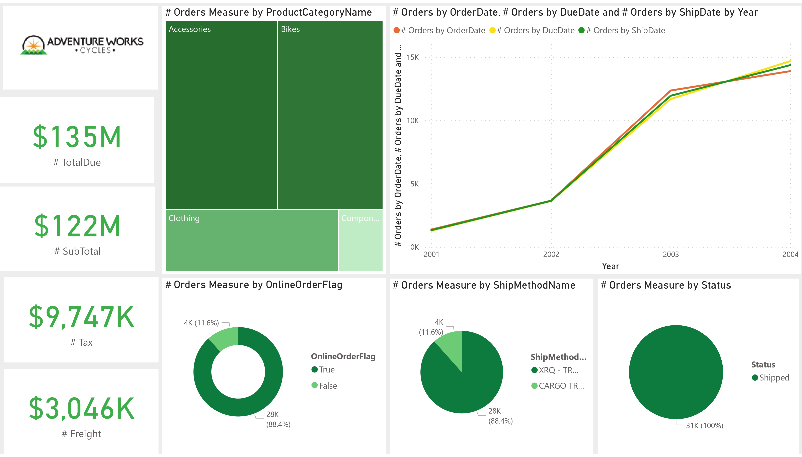
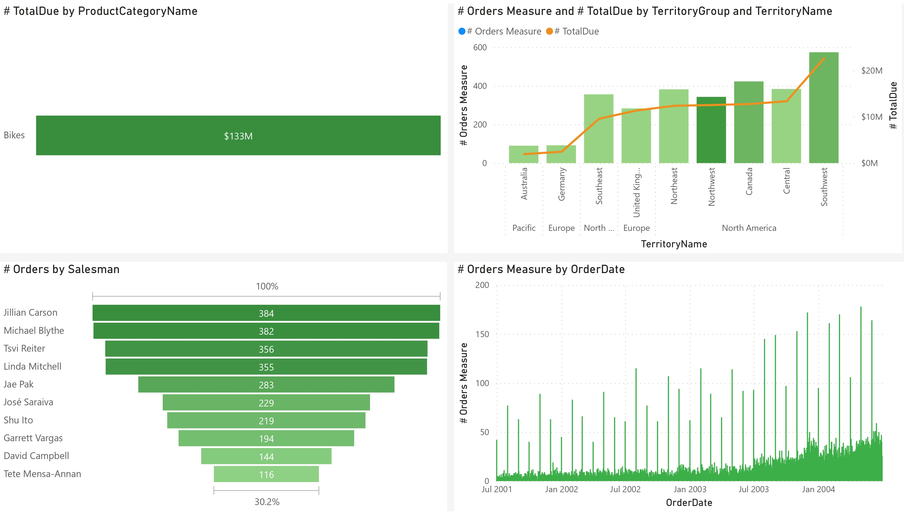

<!--<a href="https://drive.google.com/file/d/1PCh9x7s0ldE6P7bPeKNAJUxd1HLyaSKU/view?usp=sharing" target="_blank">View my Resume</a>

---
-->
## Selected projects in data analysis and data visualization 
---
### Analyzing Sales Trends and Patterns Using Tableau

I created a comprehensive Tableau dashboard with multiple tabs, enabling in-depth analysis of customer demographics, product profitability, and sales trends. Enhancing data-driven decision-making for revenue growth.

   
   
   

[View dashboard on Tableau](https://public.tableau.com/views/InternetSales2019Tableua/InternetSales?:language=en-US&:sid=&:display_count=n&:origin=viz_share_link)
  [View project on GitHub](https://github.com/sarax0/sales-analysis-tableau)

---

### AdventureWorks Sales Insights: Power BI Analysis

In this project I delved into AdventureWorks cycling e-commerce sales data for real-time insights.

   
   

 

[View project on GitHub](https://github.com/sarax0/adventureworks-sales-analysis-powerbi)

---

### Streamlining ITI Data: SSIS ETL Integration

In this project I engage in diverse SSIS exercises, emphasizing ETL processes to integrate ITI data effectively. This dataset encompasses student records, course details, departmental data, and instructor profiles. 

 

[View project on GitHub](https://github.com/sarax0/SSIS-ETL-for-ITI-Data)

---

### Sales Insights: Analyzing Data with Microsoft Analysis Services (SSAS)

I adeptly handle diverse Multidimensional Expressions (MDX) queries. This lab highlights my expertise in crafting cubes, dimensions, and MDX queries, enabling precise extraction of insights from sales data.

 

[View project on GitHub](https://github.com/sarax0/SSAS-MDX-Sales-Data)

---

### Exploring Bicycle Traffic Patterns: A Time Series Analysis of Seattle's Fremont Bridge Counts

In this project, I explore Seattle's bicycle traffic using Python. By analyzing time series data from the Fremont Bridge bike counter, I uncover trends over various intervals—daily, weekly, monthly, and yearly. 

     

[View project on GitHub](https://github.com/sarax0/fremont-bridge-time-series-analysis)
