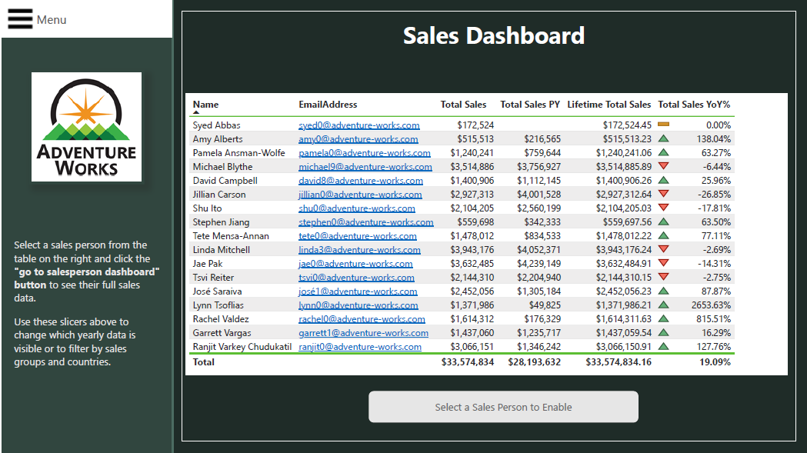
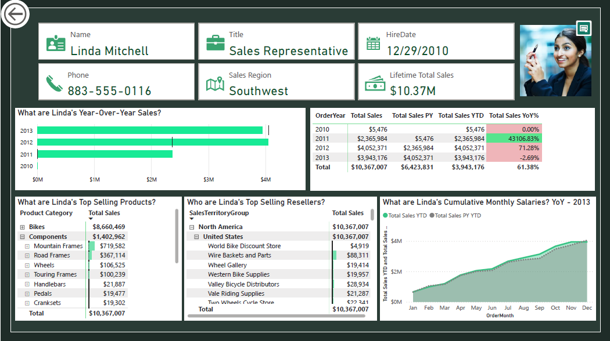

<!--<a href="https://drive.google.com/file/d/1PCh9x7s0ldE6P7bPeKNAJUxd1HLyaSKU/view?usp=sharing" target="_blank">View my Resume</a>

---
-->
## Selected projects in data analysis and data visualization 
---
### Analyzing Sales Trends and Patterns Using Tableau

I built a detailed Tableau dashboard with multiple tabs to analyze customer demographics, product profitability, and sales trends. This dashboard helps users understand key patterns and make informed decisions to drive revenue growth.

   
   
   

[View dashboard on Tableau](https://public.tableau.com/views/InternetSales2019Tableua/InternetSales?:language=en-US&:sid=&:display_count=n&:origin=viz_share_link)
  [View project on GitHub](https://github.com/sarax0/sales-analysis-tableau)

---

### AdventureWorks Sales Insights: Power BI Analysis

The dashboard provides a clear view of key metrics, including reseller performance, employee sales figures, and product trends. It features real-time data updates and custom visuals to help users dive deeper into sales information. Key elements include a date filter for tracking different time periods, a drillthrough feature for detailed employee insights, and a panel for managing slicers. I also handled binary image data by converting it to Base64, making it easy to display pictures directly in the reports.

   
   
   

 

[View project on GitHub](https://github.com/sarax0/adventureworks-sales-analysis-powerbi)

---

### Streamlining ITI Data: SSIS ETL Integration

In this project, I worked on various SSIS exercises to manage ETL processes and integrate data from ITI. This included handling student records, course information, departmental details, and instructor profiles.

 

[View project on GitHub](https://github.com/sarax0/SSIS-ETL-for-ITI-Data)

---

### Sales Insights: Analyzing Data with Microsoft Analysis Services (SSAS)

In this lab, I worked with Multidimensional Expressions (MDX) queries to build and manage cubes and dimensions. This experience showcases my ability to extract accurate insights from sales data using MDX queries.

 

[View project on GitHub](https://github.com/sarax0/SSAS-MDX-Sales-Data)

---

### Exploring Bicycle Traffic Patterns: A Time Series Analysis of Seattle's Fremont Bridge Counts

In this project, I analyzed bicycle traffic data from Seattle's Fremont Bridge using Python. I examined time series data to identify trends across different intervals, including daily, weekly, monthly, and yearly.

     

[View project on GitHub](https://github.com/sarax0/fremont-bridge-time-series-analysis)
